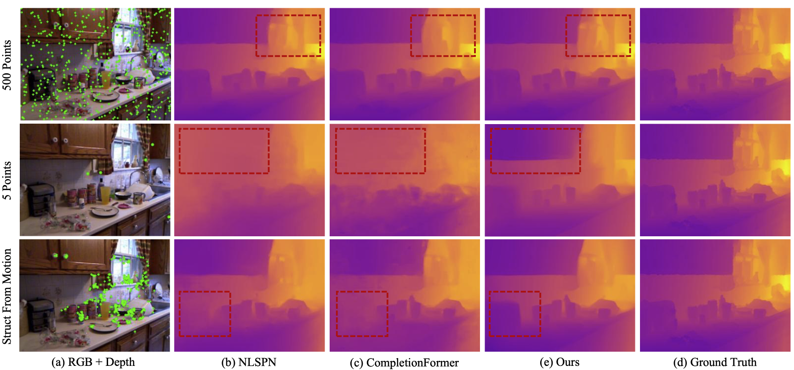

<h2>
<a href="https://whu-usi3dv.github.io/SparseDC/" target="_blank">SparseDC: Depth Completion from sparse and non-uniform inputs</a>
</h2>

This is the official PyTorch implementation of the following publication:

> **SparseDC: Depth Completion from sparse and non-uniform inputs**<br/>
> [Chen Long](https://chenlong-whu.github.io/), [Wenxiao Zhang](https://github.com/XLechter), [Zhe Chen](https://github.com/ChenZhe-Code), [Haiping Wang](https://hpwang-whu.github.io/), [Yuan Liu](https://liuyuan-pal.github.io/), [Zhen Cao](https://github.com/a4152684), [Zhen Dong](https://dongzhenwhu.github.io/index.html), [Bisheng Yang](https://3s.whu.edu.cn/info/1025/1415.htm)<br/>
> *ArXiv 2023*<br/>
> [**Paper**]() | [**Project-page**]() | [**Video**]()


## 🔭 Introduction
<p align="center">
<strong>SparseDC: Depth Completion from sparse and non-uniform inputs</strong>
</p>


<p align="justify">
<strong>Abstract:</strong> We propose SparseDC, a model for <strong>D</strong>epth <strong>C</strong>ompletion of <strong>Sparse</strong> and non-uniform depth inputs. Unlike previous methods focusing on completing fixed distributions on benchmark datasets (e.g., NYU with 500 points, KITTI with 64 lines), SparseDC is specifically designed to handle depth maps with poor quality in real usage.
The key contributions of SparseDC are two-fold.
First, we design a simple strategy, called SFFM, to improve the robustness under sparse input by explicitly filling the unstable depth features with stable image features.
Second, we propose a two-branch feature embedder to predict both the precise local geometry of regions with available depth values and accurate structures in regions with no depth. The key of the embedder is an uncertainty-based fusion module called UFFM to balance the local and long-term information extracted by CNNs and ViTs. Extensive indoor and outdoor experiments demonstrate the robustness of our framework when facing sparse and non-uniform input depths.
</p>

## 🆕 News
- 2023-11-30: Code, [Preprint paper](https://arxiv.org/abs/2310.03420) are aviliable! 🎉

## 💻 Requirements
The code has been tested on:
- Ubuntu 20.04
- CUDA 11.3
- Python 3.9.18
- Pytorch 1.12.1
- GeForce RTX 4090.

## 🔧 Installation
- First, create the conda environment:
  ```
  conda env create -f environment.yaml
  conda activate sparsedc
  ```
- Second, Build and Install the [DCN](https://github.com/charlesshang/DCNv2) Module for refiner.
  ```
  cd src/plugins/deformconv
  python setup.py build install
  ```

## 💾 Datasets
We used two datasets for training and three datasets for evaluation.

#### NYU Depth V2 (NYUv2)

We used preprocessed NYUv2 HDF5 dataset provided by [Fangchang Ma](https://github.com/fangchangma/sparse-to-dense).

```bash
$ cd PATH_TO_DOWNLOAD
$ wget http://datasets.lids.mit.edu/sparse-to-dense/data/nyudepthv2.tar.gz
$ tar -xvf nyudepthv2.tar.gz
```

After that, you will get a data structure as follows:

```
nyudepthv2
├── train
│    ├── basement_0001a
│    │    ├── 00001.h5
│    │    └── ...
│    ├── basement_0001b
│    │    ├── 00001.h5
│    │    └── ...
│    └── ...
└── val
    └── official
        ├── 00001.h5
        └── ...
```

Note that the original full NYUv2 dataset is available at the [official website](https://cs.nyu.edu/~silberman/datasets/nyu_depth_v2.html).

After preparing the dataset, you should generate a json file containing paths to individual images.

```bash
$ cd THIS_PROJECT_ROOT/utils
$ python generate_json_NYUDepthV2.py --path_root PATH_TO_NYUv2
```

Note that data lists for NYUv2 are borrowed from the [CSPN repository](https://github.com/XinJCheng/CSPN/tree/master/cspn_pytorch/datalist).


#### KITTI Depth Completion (KITTI DC)

KITTI DC dataset is available at the [KITTI DC Website](http://www.cvlibs.net/datasets/kitti/eval_depth.php?benchmark=depth_completion).

For color images, KITTI Raw dataset is also needed, which is available at the [KITTI Raw Website](http://www.cvlibs.net/datasets/kitti/raw_data.php). You can refer to [this script](https://github.com/youmi-zym/CompletionFormer/issues/8#issuecomment-1602302424) for data preparation.

The overall data directory is structured as follows:

```
├── kitti_depth
|   ├──data_depth_annotated
|   |  ├── train
|   |  ├── val
|   ├── data_depth_velodyne
|   |  ├── train
|   |  ├── val
|   ├── data_depth_selection
|   |  ├── test_depth_completion_anonymous
|   |  |── test_depth_prediction_anonymous
|   |  ├── val_selection_cropped
├── kitti_raw
|   ├── 2011_09_26
|   ├── 2011_09_28
|   ├── 2011_09_29
|   ├── 2011_09_30
|   ├── 2011_10_03
```

#### SUN RGB-D

SUN RGB-D dataset is available at the [SUN RGB-D Website](https://rgbd.cs.princeton.edu/).

We used processed dataset provided by [ankurhanda](https://github.com/ankurhanda/sunrgbd-meta-data/tree/master). The Refiner depth images are contained in the depth_bfx folder in the SUN RGB-D dataset. Also, you can directly download our organized data from [GoogleDrive]().

## 🚅 Pretrained model

You can download the pretrained model from [GoogleDrive](), and put it in folder `pretrain/`.

## ⏳ Train

To train SparseDC, you should prepare the dataset, and replace the [--data_dir](/configs/paths/default.yaml) to your data path. Then, you use the follow command:

```bash
$ python train.py experiment=final_version
```

## ✏️ Test
To eval SparseDC on three benchmarks, you can use the following commands:
```bash
$ ./eval_nyu.sh final_version final_version pretrain/nyu.ckpt
$ ./eval_kitti.sh final_version_kitti_test final_verison pretrain/kitti.ckpt
$ ./eval_sunrgbd.sh final_version final_verison pretrain/nyu.ckpt
```

## 💡 Citation
If you find this repo helpful, please give us a 😍 star 😍.
Please consider citing SparseDC if this program benefits your project


## 🔗 Related Projects
We sincerely thank the excellent projects:
- [PE-Net](https://github.com/JUGGHM/PENet_ICRA2021) for DataLoader;
- [NLSPN](https://github.com/zzangjinsun/NLSPN_ECCV20#deformable-convolution-v2-dcnv2) for metric depth completion;
- [FreeReg](https://github.com/WHU-USI3DV/FreeReg) for readme template;
- [Lightning-hydra-template](https://github.com/ashleve/lightning-hydra-template) for code organization.